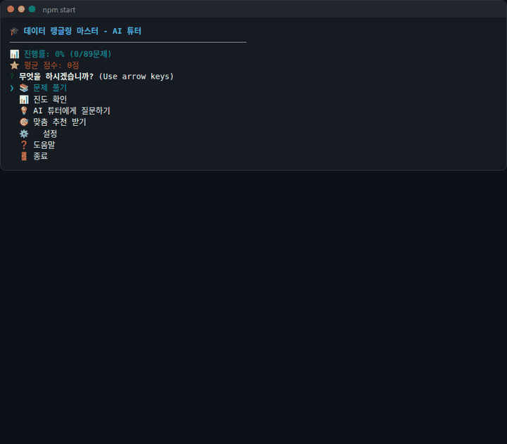
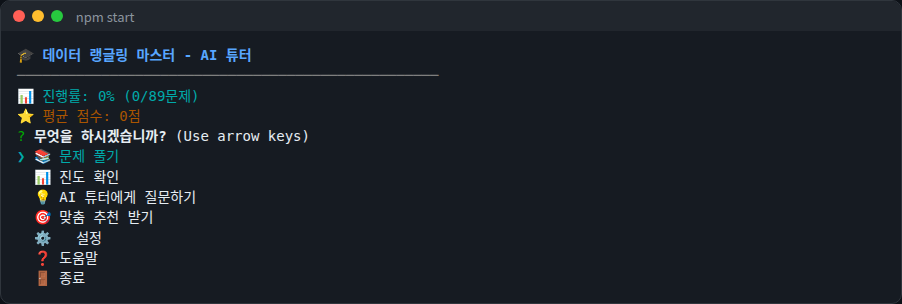
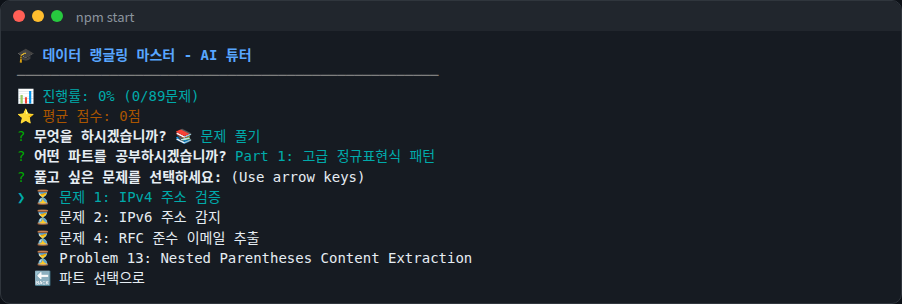
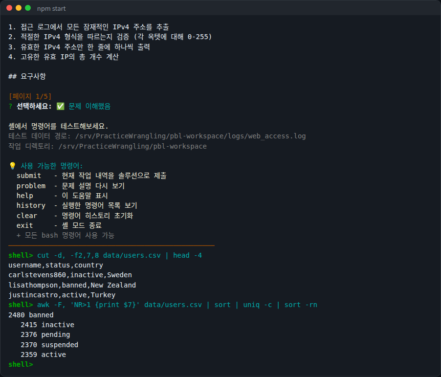
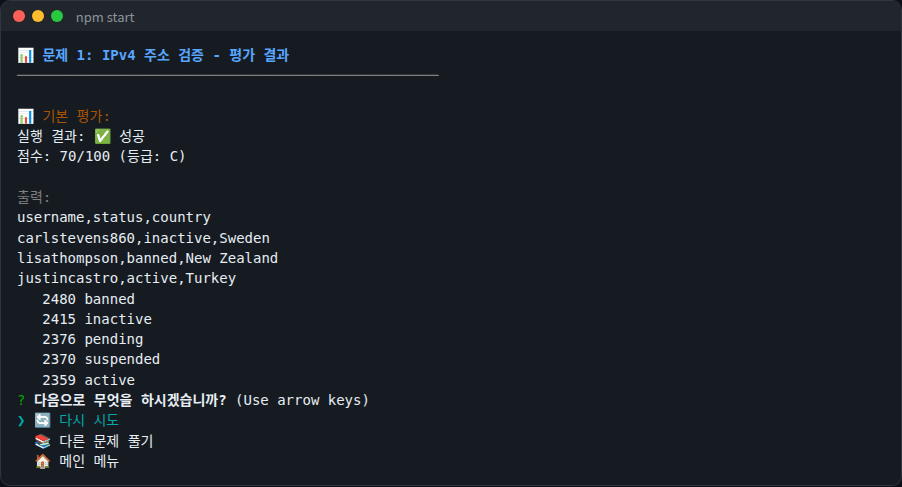
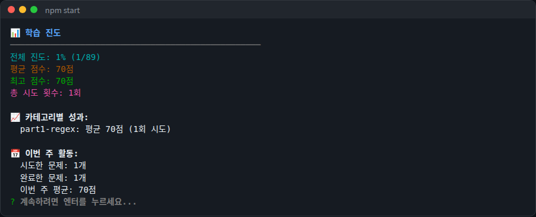

# PracticeWrangling

A Korean-language CLI (Command-Line Interface) workbook for learning data wrangling with command-line tools such as grep, sed and awk by solving problems.

**English** | [한국어](README.md)



The screens above were captured by running `npm start` from this repository. It ran without `GEMINI_API_KEY`, so the evaluation shows the basic scoring. The UI text is in Korean.

| Main menu | Problem list |
|---|---|
|  |  |

| Interactive shell | Evaluation | Progress |
|---|---|---|
|  |  |  |

## Features

- **Solve problems**: pick a part and a problem file (Markdown) under `pbl-workspace/parts/`. Long descriptions are shown page by page.
- **Interactive shell**: run bash commands at the `shell>` prompt. Commands run in `pbl-workspace/` and are stopped after 15 seconds. Successful commands are recorded and submitted together with `submit`.
  - Shell-only commands: `submit`, `problem`, `help`, `history`, `clear`, `exit`
- **Evaluation**
  - With `GEMINI_API_KEY`, Google Gemini (`gemini-2.5-pro`) scores accuracy, performance, code quality and edge cases, and returns feedback.
  - Without a key, the tool only checks whether the submitted commands exited successfully and gives 70 (C) or 30 (F).
- **AI (Artificial Intelligence) tutor questions and recommendations**: ask free-form questions or get study recommendations based on your history. Requires `GEMINI_API_KEY`.
- **Progress tracking**: attempt history, average score, per-part scores, this week's activity and badges are stored as JSON (JavaScript Object Notation) files in `pbl-workspace/.tutor-progress/`.
- **Extra commands**: `progress` (summary) and `usage` (monthly token usage estimate)
- **Practice material**: synthetic CSV (Comma-Separated Values), JSON and XML (eXtensible Markup Language) data, sample config files, regex and pipeline reference docs, and a benchmark script (`pbl-workspace/performance/benchmark.sh`)

The repository currently contains 8 problems across 5 parts. The "89 problems" shown in the UI is the planned total; most problems are not written yet. See the [progress record](docs/PROGRESS.en.md) for details.

## Usage

### 1. Install

You need Node.js, npm (Node Package Manager) and bash. Verified with Node.js 22.

```bash
git clone https://github.com/patissierMongs/PracticeWrangling.git
cd PracticeWrangling
npm install
```

### 2. Set the Gemini key (optional)

To use the AI tutor, set an API (Application Programming Interface) key from Google AI Studio as an environment variable. The code does not read `.env` files, so set it in your shell.

```bash
export GEMINI_API_KEY="your-api-key"
```

Without a key, problem solving, the interactive shell, basic scoring and progress tracking still work.

### 3. Run

Run from the repository root. The program looks for `pbl-workspace/` under the current directory.

```bash
npm start
```

If the first run fails with an error that `stats.json` was not found, run it again. The progress files are read before their creation has finished.

### 4. Basic flow

1. In the main menu, choose **📚 문제 풀기** (Solve problems).
2. Pick a part and a problem, then choose **✏️ 솔루션 작성** (Write solution).
3. Page through the description, then try commands at the `shell>` prompt.
   ```text
   shell> cut -d, -f2,7,8 data/users.csv | head -4
   shell> awk -F, 'NR>1 {print $7}' data/users.csv | sort | uniq -c | sort -rn
   ```
4. Check the recorded commands with `history`, then `submit`.
5. Read the evaluation, then retry or move on to another problem.
6. Open **📊 진도 확인** (Progress) to see your history.

### 5. Other commands

```bash
node src/cli.js --help      # list commands
node src/cli.js progress    # progress summary (progress files must exist)
node src/cli.js usage       # monthly token usage estimate
npm run test:local -- 01 <solution.sh>   # run a solution script locally
```

`pbl-workspace/logs/` is listed in `.gitignore` and is not in the repository. Problems that read log files such as `logs/web_access.log` need those files prepared separately. Files under `data/` are ready to use.

## Tech stack

| Area | Details |
|---|---|
| Languages | JavaScript (Node.js, CommonJS), Bash |
| CLI | commander ^12.0.0, inquirer ^8.2.6, chalk ^4.1.2, ora ^5.4.1 |
| AI | @google/generative-ai ^0.21.0 (model `gemini-2.5-pro`) |
| Files | fs-extra ^11.2.0 |
| Dev tools | nodemon ^3.1.0, jest ^29.7.0 (no test files yet) |

`package.json` also lists yaml, marked and marked-terminal, but the current code does not import them.

## Docs

- [Progress record](docs/PROGRESS.en.md): final goal, feature status, work history
- [Setup guide (Korean)](docs/SETUP.md): installation and troubleshooting
- [Workbook request (Korean)](docs/REQUEST.md): original requirements for the problem set
- [Workbook overview (Korean)](pbl-workspace/README.md), [Getting started (Korean)](pbl-workspace/GETTING_STARTED.md)

## License

`package.json` declares the MIT license. There is no separate LICENSE file.
